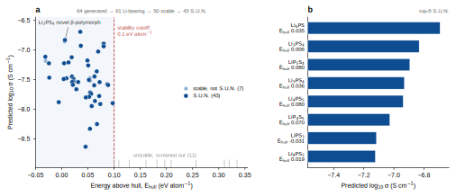

# Project 3 (bonus) — Generative Inverse Design: generate → screen → score

**What this is.** A concept-validation bonus that demonstrates the inverse-design paradigm and
wires up a full `generate → screen → validate` loop. **Synthesizability is explicitly not
claimed** — the point is the method and the closed loop, not the individual candidates.

Position in the portfolio's screening funnel:
Project 1 (screening) → **Project 3 (generate new candidates)** → Project 2 (high-accuracy
MLIP-MD validation) → future electrochemical experiment.

## MVP

1. **Generate** — sample candidate structures from a pretrained **MatterGen** diffusion model,
   **conditioned on the chemical system Li-P-S**.
2. **Stability screen** — relax each candidate with a universal MLIP (**MACE-MP-0**), compute
   `e_above_hull` (energy above the convex hull), and report **S.U.N.** (Stable + Unique + Novel)
   — the same lens MatterGen reports for itself.
3. **Score** — apply **Project 1's OBELiX-trained CatBoost conductivity model** to give survivors
   a coarse ranking prior.
4. **Output** — a shortlist of "new and relatively stable" candidates to hand to Project 2 MLIP-MD.

## Numbered pipeline scripts + reusable `src/` (same convention as Projects 1 & 2)

| script | role | runs on |
|---|---|---|
| `src/generate.py` + `01_generate.py` | `--source mattergen` runs the official conditional-generation CLI; `--source from-results` reads an existing `*_cif.zip`; `--source mp-demo` pulls real Li-P-S phases as an **offline plumbing fixture** (not generative output; `--rattle` displaces atoms to mimic unrelaxed cells) | mattergen=GPU; else CPU |
| `src/stability.py` + `02_screen_stability.py` | reference phases **and** candidates relaxed with the **same** MLIP → **self-consistent convex hull** → `e_above_hull`; `--calc mace\|chgnet` (real) / `lj` (CPU plumbing fixture, energies meaningless) | GPU (except lj) |
| `src/novelty.py` | StructureMatcher de-dup among candidates (Unique) + comparison against known MP phases (Novel) | CPU |
| `src/score.py` + `03_score_conductivity.py` | applies the vendored Project-1 model (`featurize`/`predict` + `catboost_model.cbm`) to give each candidate a log₁₀σ prior | CPU |
| `04_rank_candidates.py` | merge screen + score → `candidates_final.csv` + `p3_runs.json` + two quick-look figures | CPU |
| `figures/make_publication_figure.py` | builds a **publication-grade composite figure** from `candidates_final.csv` (landscape + shortlist, two panels, vector SVG) | CPU |
| `notebooks/01_mattergen_pipeline.ipynb` | cloud orchestration: stage A (isolated py3.10 venv runs MatterGen) → stage B (MACE screen + score) | Colab T4 / Vanda |

```bash
# 0) install deps (Python 3.10-3.12; MatterGen generation is a SEPARATE py3.10 env, installed
#    separately -- see HPC_VANDA.md)
pip install -r requirements.txt

# local (CPU plumbing check, no GPU) -- proves the generate->screen->score->rank wiring works
python 01_generate.py --source mp-demo --max-demo 6 --rattle 0.1
python 02_screen_stability.py --calc lj --steps 3 --no-relax-cell
python 03_score_conductivity.py
python 04_rank_candidates.py --top 5

# cloud (GPU production) -- see notebooks/01_mattergen_pipeline.ipynb
python 01_generate.py --source mattergen --chemsys Li-P-S --batch-size 16 --num-batches 4
python 02_screen_stability.py --calc mace --ehull-cutoff 0.1
python 03_score_conductivity.py --stable-only && python 04_rank_candidates.py --top 5
```

> **Self-contained scoring.** The Project-1 conductivity model is **vendored** under `vendor/`
> (`catboost_model.cbm` + a self-contained `p1_conductivity.py`), so this repo clones and runs on
> its own — **no need to clone Project 1 alongside**. If the
> [Project 1 repo](https://github.com/E1582271-dotcom/Solid-Electrolyte-Screening) happens to sit
> beside it (monorepo layout), `score.py` uses that instead — predictions are identical.

## Design decisions

- **Two-stage isolation.** MatterGen pins Python 3.10 with its own torch/lightning stack, which
  clashes with the MACE screening environment. Generation runs as a CLI subprocess in a dedicated
  venv; screening/scoring run in the kernel; the `--source from-results` seam joins them, so the
  screening environment **does not depend on the mattergen package**.
- **Self-consistent MLIP hull** (not mixed MP/PBE energies). Reference phases and candidates are
  relaxed with the same universal MLIP before building the hull, avoiding the systematic
  `e_above_hull` bias you get from mixing "MLIP candidate energy vs PBE+U reference energy"
  (inconsistent reference states) — this matches MatterGen's own evaluator. Reference energies are
  cached by `material_id`, so re-runs are fast.
- **CPU plumbing fixtures** (`mp-demo` + `lj`). Following Project 1's `--demo` / Project 2's
  Lennard-Jones idea, the whole downstream pipeline can be developed and verified on a GPU-less
  laptop; those outputs are clearly labelled "plumbing check, non-physical".
- **Require the mobile ion Li** (`01_generate.py --require-elements Li`, on by default). Conditioned
  on `chemical_system=Li-P-S`, MatterGen also emits **Li-free P–S binaries**, which the Project-1
  model happily scores — so a Li-ion-conductor screen must first require Li, or the shortlist head
  fills with meaningless Li-free phases (this run dropped 3 Li-free phases, keeping 61).
- **Portable reference cache** (`data/ref_structures.json`, not a pickle). Reference phases are
  cached as pymatgen `Structure` (`as_dict`), readable across pymatgen versions; a directly pickled
  MP entry fails to unpickle when the two ends run different pymatgen versions, so we use structure
  JSON.

## Known limitations (disclosed)

- **Most generated structures are unstable / unsynthesizable** → they must pass the MLIP stability
  screen (this project's core signal).
- `e_above_hull` comes from an **un-fine-tuned** universal MLIP: a relative-stability indicator, not
  DFT-quantitative. The self-consistent hull removes the reference-state mismatch, but the MLIP's own
  bias remains.
- The conductivity score is a **coarse ranking prior** (Project-1 model): generated stoichiometries
  score with `Family='unknown'` and are often P1-symmetry; the score is for ranking and handoff to
  Project 2 MD only — **not a quantitative σ**.
- MatterGen's own paper validated a single synthesis → this is positioned as **concept validation**,
  with no over-promise.

## Status

- ✅ **Local CPU end-to-end plumbing verified** (`mp-demo`, 6 real Li-P-S phases + `lj` hull):
  generate → screen (`e_above_hull` + de-dup + novelty, 96 MP reference phases incl. Li/P/S
  endpoints) → score (Project-1 CatBoost bridge, cross-project `src` name clash isolated) → rank +
  2 figures, all wired.
  *Note: `lj` energies are non-physical and `mp-demo` fixtures are not generative output, so
  `novel=False` for all of them (they are known phases) — which correctly confirms the novelty test.*
- ✅ **Cloud production run (NUS Vanda A40, 2026-07-01)**: MatterGen conditional generation of
  Li-P-S (batch 16×4=64) → Li filter (dropped 3 Li-free P–S binaries, keeping 61) → MACE-MP-0
  self-consistent hull screen (96 reference phases) → Project-1 CatBoost scoring → ranked figures.
  See `HPC_VANDA.md` (PBS + Singularity, reusing Project 2's `~/macepkg`, entirely free).
- ⬜ W11: hand the shortlist head to Project 2 MLIP-MD for a real σ/Eₐ; draw the unified pipeline diagram.

## Results (NUS Vanda A40, 2026-07-01)

**61 generated → 50 stable → 54 unique → 61 novel → 43 S.U.N.** (`ehull_cutoff=0.1 eV/atom`; full
table in `data/candidates_final.csv`, parameters/counts in `data/p3_runs.json`).



*Publication figure (`figures/fig_inverse_design.svg` vector master + a 600-dpi `.png` raster,
produced by `make_publication_figure.py`).*

S.U.N. shortlist head (all Stable + Unique + Novel, ranked by the Project-1 model's predicted log₁₀σ):

| candidate | e_above_hull (eV/atom) | predicted log₁₀σ (S/cm) | note |
|---|---|---|---|
| Li6PS   |  0.035 | −6.69 | |
| Li3PS4  |  0.006 | −6.83 | β-Li3PS4 is a known fast-ion conductor; this is a generated **novel polymorph**, essentially on the hull |
| LiP5S4  |  0.080 | −6.89 | |
| Li3PS4  |  0.036 | −6.93 | another novel Li3PS4 polymorph |
| Li4PS5  |  0.080 | −6.94 | argyrodite-adjacent stoichiometry |
| LiPS3   | −0.031 | −7.12 | `e_above_hull < 0` → an MLIP-predicted **new ground state** |
| Li8PS2  |  0.019 | −7.12 | |

> Honest disclosure: `e_above_hull` comes from an **un-fine-tuned** MACE-MP-0 (relative stability,
> not DFT-quantitative); log₁₀σ is the Project-1 model's **coarse ranking prior, not a quantitative
> σ**; generated stoichiometries are often P1-symmetry. The shortlist is handed to Project 2 MLIP-MD
> for high-accuracy validation — positioned as **concept validation**, with no synthesizability claim.
