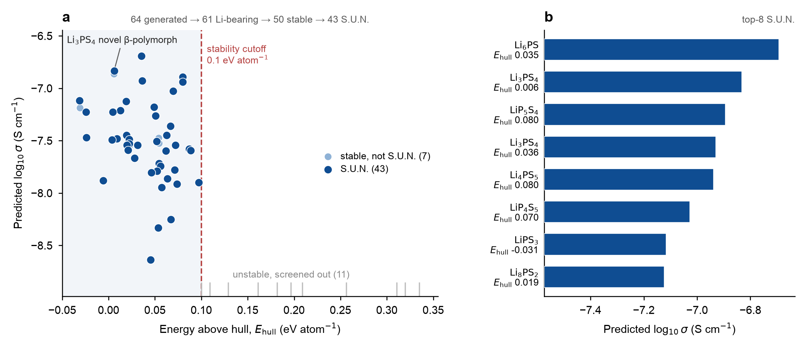

# 项目三（彩蛋）：生成式逆向设计 — generate → screen → score

**定位**：概念验证（concept-validation）彩蛋，展示理解 inverse-design 范式 + 能串起
`generate → screen → validate` 闭环。计划周 W10，里程碑③一部分。
**明确不追求合成可行性** —— 评委知道 demo 难落地，把它当主菜反而信号弱；申请材料里只写「概念验证」。

在串联叙事中的位置：
项目一(筛选) → **项目三(生成新候选)** → 项目二(高精度 MLIP-MD 验证) → 未来电化学实验闭环。

## MVP（已实现，本机 CPU 端到端验证管路通）

1. **生成**：HF 上 MatterGen 预训练模型，**以化学体系 Li-P-S 为条件**采样候选结构。
2. **稳定性筛**：universal MLIP（MACE-MP-0）算 `e_above_hull`（凸包上能量）筛掉不稳定结构，
   并报告 **S.U.N.**（Stable + Unique + Novel）—— MatterGen 自身用的标准透镜。
3. **打分**：用**项目一的 OBELiX-CatBoost 电导率模型**给存活候选一个粗排序先验。
4. **输出**：几个「新且相对稳定」的候选，交给项目二 MLIP-MD 验证。

## 线性编号脚本 + 可复用 `src/`（沿用项目一、二约定）

| 脚本 | 作用 | 跑在哪 |
|---|---|---|
| `src/generate.py` + `01_generate.py` | `--source mattergen` 跑官方 CLI 条件生成；`--source from-results` 读已生成的 `*_cif.zip`；`--source mp-demo` 拉真实 Li-P-S 相做**离线管路替身**（非生成输出，`--rattle` 扰动模拟未弛豫） | mattergen=GPU；其余=CPU |
| `src/stability.py` + `02_screen_stability.py` | 参考相与候选用**同一** MLIP 弛豫 → **自洽凸包** → `e_above_hull`；`--calc mace\|chgnet`（真实计算）/`lj`（CPU 管路替身，能量无意义） | GPU（lj 除外） |
| `src/novelty.py` | StructureMatcher 候选间去重（Unique）+ 与 MP 已知相比对（Novel） | CPU |
| `src/score.py` + `03_score_conductivity.py` | **跨项目复用项目一模型**（导入其 `featurize`/`predict` + `catboost_model.cbm`）给候选打 log₁₀σ 先验 | CPU |
| `04_rank_candidates.py` | 合并 screen+score → `candidates_final.csv` + `p3_runs.json` + 两张快查图 | CPU |
| `figures/make_publication_figure.py` | 由 `candidates_final.csv` 出**出版级合成 figure**（landscape + shortlist 双 panel，矢量 SVG/PDF/PNG） | CPU |
| `notebooks/01_mattergen_pipeline.ipynb` | 云端编排：阶段 A（隔离 py3.10 venv 跑 MatterGen）→ 阶段 B（MACE 筛 + 打分） | Colab T4 / Vanda |

```bash
# 本机（CPU 管路验证，全程不需 GPU）—— 证明 generate→screen→score→rank 接线通
~/Code/AI4SSB/.venv/bin/python 01_generate.py --source mp-demo --max-demo 6 --rattle 0.1
~/Code/AI4SSB/.venv/bin/python 02_screen_stability.py --calc lj --steps 3 --no-relax-cell
~/Code/AI4SSB/.venv/bin/python 03_score_conductivity.py
~/Code/AI4SSB/.venv/bin/python 04_rank_candidates.py --top 5

# 云端（GPU 生产）—— 见 notebooks/01_mattergen_pipeline.ipynb
python 01_generate.py --source mattergen --chemsys Li-P-S --batch-size 16 --num-batches 4
python 02_screen_stability.py --calc mace --ehull-cutoff 0.1
python 03_score_conductivity.py --stable-only && python 04_rank_candidates.py --top 5
```

> **目录约定**：`score.py` 向上找 `../project1_screening/`（复用项目一 `catboost_model.cbm`），
> 所以两个 project 文件夹须并排（即 `~/Code/AI4SSB/` 的布局）。云端用 zip 上传须保留此结构。

## 设计决策

- **双阶段隔离**：MatterGen 钉 Python 3.10 + 自有 torch/lightning 栈，与 MACE 筛选环境易冲突 →
  生成走独立 venv 的 CLI 子进程，筛选/打分走 kernel；中间用 `--source from-results` 这条缝衔接，
  筛选环境**不依赖 mattergen 包**。
- **自洽 MLIP 凸包**（非混用 MP/PBE 能量）：参考相和候选都用同一 universal MLIP 弛豫后建凸包，
  避免「MLIP 候选能量 vs PBE+U 参考能量」参考态不一致导致的系统性 `e_above_hull` 偏差 ——
  这与 MatterGen 自身评测器一致。参考相能量按 `material_id` 缓存，重跑很快。
- **CPU 管路替身**（`mp-demo` + `lj`）：沿用项目一 `--demo` / 项目二 Lennard-Jones 的思路，让整条
  下游管线能在无 GPU 笔记本上开发+验证；产物明确标注「管路检查、非物理结果」。
- **必须含迁移离子 Li**（`01_generate.py --require-elements Li`，默认开）：MatterGen 按 `chemical_system=Li-P-S`
  条件生成时也会产出**不含锂的 P–S 二元相**，项目一模型照样给它们打分——锂导体筛选须先要求含 Li，否则
  shortlist 头部会混进无意义的无锂相；默认开启此过滤（本次运行剔除 3 个无锂相，留 61）。
- **可移植参考缓存**（`data/ref_structures.json`，非 pickle）：参考相以 pymatgen `Structure`（as_dict）缓存，
  跨 pymatgen 版本可读；直接 pickle 的 MP 实体会因两端 pymatgen 版本不同而解不开，故用结构 JSON。

## 常见陷阱（必须披露）

- **生成结构大多不稳定/不可合成** → 必须过 MLIP 稳定性筛（本项目的核心信号点）。
- `e_above_hull` 来自**未微调** universal MLIP，是相对稳定性指标、非 DFT 级定量；自洽凸包消了参考态
  不一致，但 MLIP 自身偏差仍在。
- 电导率分是**粗排序先验**（项目一模型）：生成的新化学计量比 `Family='unknown'`、对称性常为 P1，
  分数只用于排序、交项目二 MD 验证，**非定量 σ**。
- MatterGen 原论文仅做一例合成验证 → 申请材料**不过度承诺**，定位「概念验证」。

## 状态

- ✅ **本机 CPU 端到端管路验证通过**（`mp-demo` 6 个真实 Li-P-S 相 + `lj` 凸包）：
  generate → screen（`e_above_hull` + 去重 + 新颖性，96 个 MP 参考相含 Li/P/S 端点）→ score（项目一
  CatBoost 桥接，跨项目 `src` 包冲突已隔离处理）→ rank + 2 图，全程跑通。
  *注：`lj` 能量无物理意义、`mp-demo` 替身非生成输出，故 `novel=False` 全中（替身本就是已知相）—— 这恰证明新颖性判定正确。*
- ✅ **云端生产运行（NUS Vanda A40，2026-07-01）**：MatterGen 条件生成 Li-P-S（batch 16×4=64）→ Li 过滤
  （剔除 3 个不含锂的 P–S 二元相，留 61）→ MACE-MP-0 自洽凸包筛（96 参考相）→ 项目一 CatBoost 打分 → 排序出图。
  跑法见 `HPC_VANDA.md`（PBS + Singularity，复用项目二 `~/macepkg`，全程免费）。
- ⬜ W11：把 shortlist 头部喂项目二 MLIP-MD 算真实 σ/Eₐ；画统一 pipeline 流程图。

## 结果（NUS Vanda A40，2026-07-01）

**61 生成 → 50 稳定 → 54 unique → 61 novel → 43 S.U.N.**（`ehull_cutoff=0.1 eV/atom`；完整表见
`data/candidates_final.csv`，参数/计数见 `data/p3_runs.json`）。



*出版级 figure（`figures/fig_inverse_design.{svg,pdf,png}`，由 `make_publication_figure.py` 生成）。*

S.U.N. shortlist 头部（全部 Stable+Unique+Novel，按项目一模型预测 log₁₀σ 降序）：

| 候选 | e_above_hull (eV/atom) | 预测 log₁₀σ (S/cm) | 备注 |
|---|---|---|---|
| Li6PS   |  0.035 | −6.69 | |
| Li3PS4  |  0.006 | −6.83 | β-Li3PS4 是已知快离子导体；此为生成的**新颖多形体**，几乎在凸包上 |
| LiP5S4  |  0.080 | −6.89 | |
| Li3PS4  |  0.036 | −6.93 | Li3PS4 的另一新颖多形体 |
| Li4PS5  |  0.080 | −6.94 | argyrodite 邻近计量比 |
| LiPS3   | −0.031 | −7.12 | `e_above_hull<0` → MLIP 预测的**新基态** |
| Li8PS2  |  0.019 | −7.12 | |

> 诚实披露：`e_above_hull` 来自**未微调** MACE-MP-0（相对稳定性、非 DFT 定量）；log₁₀σ 是项目一模型的
> **粗排序先验、非定量 σ**；生成的新计量比对称性常为 P1。shortlist 交项目二 MLIP-MD 做高精度验证——
> 定位「概念验证」，不主张可合成。
